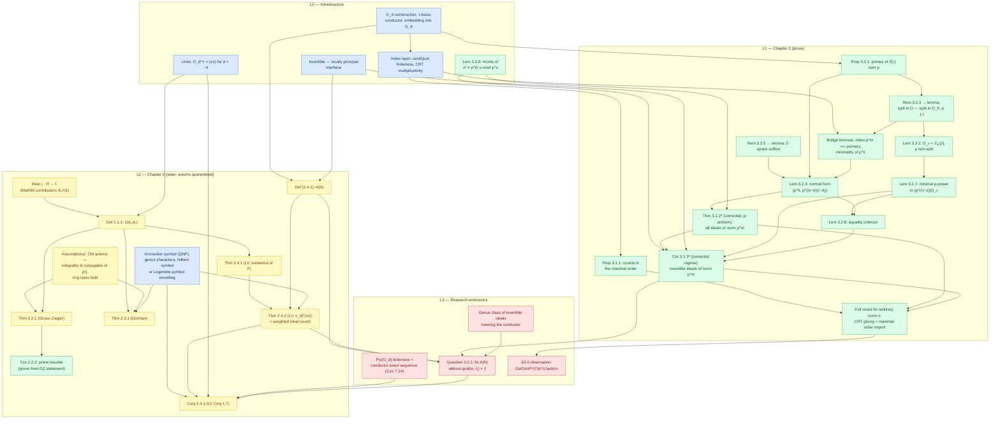

# Formalization Plan — *Singular Moduli and the Ideal Class Group* in Lean 4

Master planning document. Companions: [ERRATA.md](ERRATA.md) (statement corrections the
blueprint must target — the thesis contains two provably false cases in Thm 3.1.2 and a
wrong boundary regime in Cor 3.1.3; see there for counterexamples),
[WORKPLAN.md](WORKPLAN.md) (execution: theorem-sized work packages with owners,
interfaces, and acceptance criteria), and
[docs/proof-map.html](docs/proof-map.html) (interactive status graph).

All Mathlib declaration names below were mechanically verified against Loogle / the
mathlib4 docs on **2026-07-14** (Mathlib master). Names from external projects are
attributed explicitly.

---

## 1. Strategy in one page

The thesis has two very different halves, and the plan treats them differently:

- **Chapter 3 (ideal counting in imaginary quadratic orders) — PROVE IT.** It is
  self-contained commutative algebra. Every mathematical ingredient either exists in
  Mathlib or is elementary. This is the core deliverable and is achievable.
- **Chapter 2 (Gross–Zagier, Dorman, Lauter–Viray) — STATE IT, don't prove it.** The
  proofs need CM theory, ring class fields, and quaternion-order arithmetic — none of
  which exist in any Lean project today (the Clay/Buzzard `ClassFieldTheory` project is
  building the prerequisites; realistic horizon: years). We state these results precisely
  against clean interfaces, quarantine the deep inputs as FLT-style documented axioms,
  and wire Chapter 3's counting results into the statement of Lauter–Viray Thm 1.5 and
  Conj 1.7 so that the *bridge* — the thesis's actual contribution — is fully formal.
- **Readability is the top-level requirement**, not an afterthought. The previous attempt
  died of unruly theorems. The antidote is the **blueprint paradigm** plus a small set of
  statement-discipline rules (§6): every Lean declaration has a prose twin, standing
  hypotheses live in one bundling structure, headline statements live in proof-free files
  a human can audit in minutes, and `leanblueprint checkdecls` mechanically prevents
  prose/code drift.

Sequencing: **Phase 0 spike → infra layer → Ch. 3 proofs → Ch. 2 statement layer →
research extensions (Question 3.0.1 / Conj 2.4.3)**. Details in §7.

---

## 2. Inventory of thesis results

| ID | What | Proved in thesis? | Plan | Difficulty |
|----|------|-------------------|------|-----------|
| Def 1.1.1 | J(d₁,d₂) = ∏(j(τ₁) − j(τ₂)) | — (definition) | State (needs j; see §5.3) | hard |
| §2.1 facts | j-function, singular moduli CM facts, finiteness of class group, integrality of J | cited | Axiom/interface layer | research-level |
| Thm 2.2.1 | Gross–Zagier factorization | cited | State + axiom | research-level |
| Cor 2.2.2 | Bound on primes dividing J | cited | State; provable *from* 2.2.1 (elementary QR arguments) | moderate |
| Thm 2.3.1 | Dorman's formula | cited | State + axiom | research-level |
| Thm 2.4.1 | Lauter–Viray: existence of F | cited | State + axiom | research-level |
| Def (2.4.2) | The ideal count A(N) | — (definition) | **Define formally** (load-bearing for Q 3.0.1) | moderate |
| Thm 2.4.2 | v_ℓ(F(m)) as weighted ideal count | cited | State + axiom | research-level |
| Conj 2.4.3 | LV Conjecture 1.7 | conjecture | State (after re-transcription, ERRATA E7) | research-level |
| Q 3.0.1 | Fix A(N) without gcd(m, f₁) = 1 | open | Research target (Phase 4) | research-level |
| Prop 3.1.1 | Ideal counts in the maximal order | ✔ | **Prove** | moderate |
| Thm 3.1.2 | Count of all ideals of norm p^m, p \| f | ✔ (2 cases false, ERRATA E1–E4) | **Prove corrected p-uniform version** | hard |
| Cor 3.1.3 | Count of invertible ideals of norm p^m | ✔ (regime bug, ERRATA E5) | **Prove corrected version** | hard |
| Prop 3.2.1 | Primes of ℤ[τ] over p via factoring g mod p | ✔ | **Prove** (Kummer–Dedekind exists away from conductor; at p \| f prove by hand on O/pO ≅ 𝔽_p[x]/(ḡ)) | moderate |
| Lem 3.2.2 | O_𝔭 = ℤ₍ₚ₎[τ] for non-split p | ✔ | **Prove** | moderate |
| Rem 3.2.3 | split in O ⇔ split in O_K and p ∤ f | asserted, unproved | **Prove** (promote to lemma) | moderate |
| Lem 3.2.4 | Normal form (p^k, p^{m−k}(τ−A)) of p-primary ideals | ✔ | **Prove** + two bridge lemmas (ERRATA E6.4) | hard |
| Rem 3.2.5 | ℤ-spans suffice | ✔ | **Prove** (promote to lemma) | easy |
| Lem 3.2.6 | #solutions of x² ≡ p^{2r}u mod p^s | ✔ | **Prove** — self-contained, first `ForMathlib` target | moderate |
| Lem 3.2.7 | Minimal p-power in (p^r(τ−s))O_𝔭 | ✔ | **Prove** (add standing hypotheses, ERRATA E6.2) | moderate |
| Lem 3.2.8 | Equality criterion for principal local ideals | ✔ | **Prove** (spell out delegation) | moderate |
| §3.4 | Ga/Gm/P¹(ℤ/p^r) observation | remark | Formalize the numerology as a theorem (nice stretch goal) | moderate |

---

## 3. What already exists (verified)

### 3.1 Mathlib — strong

| Area | Key declarations (all verified) |
|------|-------------------------------|
| Ideal norms | `Ideal.absNorm`, `Ideal.absNorm_eq_index`, `Ideal.finite_setOf_absNorm_eq` — **caveat §4.1: the bundled multiplicative API is Dedekind-gated** |
| Dedekind machinery | `Ideal.uniqueFactorizationMonoid`, `Ideal.primesOver`, `Ideal.ramificationIdx`, `Ideal.inertiaDeg`, `Ideal.sum_ramification_inertia` |
| Kummer–Dedekind | `KummerDedekind.normalizedFactorsMapEquivNormalizedFactorsMinPolyMk`; polished number-field version (2025-26): `NumberField.Ideal.primesOverSpanEquivMonicFactorsMod`, `RingOfIntegers.exponent` — **excludes conductor primes**, which is exactly where Ch. 3 lives |
| Conductor (of a monogenic subring) | `conductor`, `mem_conductor_iff`, `Localization.localRingHom_bijective_of_not_conductor_le`, `comap_map_eq_map_adjoin_of_coprime_conductor` |
| Class/Picard groups | `ClassGroup` (any domain — for an order this *is* Pic(O)), `CommRing.Pic`, `ClassGroup.equivPic`, `ClassGroup.extendedHom` (Pic(O) → Cl(K) map), finiteness only for maximal orders (`ClassGroup.fintypeOfAdmissibleOfFinite`, `NumberField.classNumber`) |
| Primary decomposition | `Ideal.IsPrimary`, `Ideal.isLasker` (Lasker–Noether), `Localization.AtPrime`, `IsDiscreteValuationRing.TFAE` |
| Quadratic residues | `legendreSym`, `jacobiSym`, reciprocity, `legendreSym.card_sqrts` (mod p only), `ZMod.isCyclic_units_of_prime_pow`, `Nat.totient_prime_pow` |
| Hensel / valuations | `hensels_lemma`, `HenselianLocalRing`, `padicValNat`/`padicValInt`, `PadicInt.valuation` |
| Rank-2 algebra model | `QuadraticAlgebra R a b` (new; free rank-2 R-algebra with i² = a + b·i — can model any ℤ[ω] including non-maximal orders), `Algebra.IsQuadraticExtension`, `Zsqrtd`, `GaussianInt` |
| Modular forms | `ModularForm`, `ModularGroup.fd` (fundamental domain), `eisensteinSeries` + q-expansions, `ModularForm.eta`, `ModularForm.discriminant` (Δ = η²⁴, 2026), level-one dimension formulas, `UpperHalfPlane.qExpansion` |
| Elliptic curves | `WeierstrassCurve.j` (algebraic j), group law, `WeierstrassCurve.ofJ`, reduction over DVRs (2025-26), `PeriodPair.weierstrassP` + differential equation (℘′² = 4℘³ − g₂℘ − g₃, new) |
| Analytic NT | `NumberField.dedekindZeta` + residue formula (full analytic class number formula), `NumberField.Ideal.tendsto_norm_le_and_mk_eq_div_atTop`, Dirichlet characters/L-functions/Euler products |
| Numerics | `norm_num` extensions for primality and Jacobi symbols (`Tactic.NormNum.evalJacobiSym`), `decide` on ZMod goals |

### 3.2 External Lean projects

- **[WangFrankie/QuadraticNumberFields](https://github.com/WangFrankie/QuadraticNumberFields)**
  (Lean 4, Apache-2.0, ~21k LoC, active as of 2026-07-10, Zenodo DOI). The single biggest
  accelerant. Contains: Kronecker symbol `kroneckerSym` (+ as Dirichlet character; Mathlib
  has none), prime splitting in ℚ(√d) via Legendre/Kronecker, binary quadratic forms with
  executable reduction + enumeration, Gauss composition, the form class group with group
  law, **`formClassEquivClassGroup` : FormClass(D) ≃ ClassGroup(O_K) for fundamental
  D < 0** (Cox Ch. 1–2 + 7A), classNumber = #reduced forms, worked class groups
  (D = −20, −23, −84), Stark–Heegner class-number-one work. Active WIP branches on genus
  theory and ring class numbers of conductor 2 — **coordinate with the author instead of
  duplicating** (genus characters are needed for Dorman/LV statements). Caveat:
  fundamental discriminants only; non-maximal orders are still ours to build.
- **[ImperialCollegeLondon/FLT](https://github.com/ImperialCollegeLondon/FLT)** — pattern
  donor (Assumptions/ axiom quarantine, Mathlib-path-mirrored upstream dir), plus real
  quaternionic infrastructure (Fujisaki lemma, sorry-free) if Phase 4 ever needs it.
- **[kbuzzard/ClassFieldTheory](https://github.com/kbuzzard/ClassFieldTheory)** (2025 Clay
  summer school) — where ring class fields / Artin map will eventually come from. Watch,
  don't wait.
- **lean-forward/class-group-and-mordell-equation** (Lean 3, CPP 2023) — the `sageify`
  pattern: Sage as an untrusted oracle emitting Lean-checkable certificates. Right
  architecture for numerically checking Gross–Zagier factorizations.

### 3.3 The existing `singular_moduli/` codebase (previous attempt, this repo)

The repo already contains ~2,300 lines of sorry-free Lean from the earlier attempt
(main, last touched 2026-06-08). Salvage assessment:

| Piece | Status | Verdict |
|-------|--------|---------|
| `QuadraticOrder/Basic,Norm,Discriminant` — O_d for all d, τ, basis, norm form via conjugate + Vieta | ✅ done | **Keep.** This is gap-list item 1 (§4.1), already built as a bespoke pair-type — validates decision D2 |
| `Prime/{PolyMod,QuotientIso,Inert,Ramified,Split}` — trichotomy transported across `O/(p) ≅ 𝔽ₚ[X]/(g)` | ✅ done | **Keep.** Covers Prop 3.2.1 + Rem 3.2.3 essentials; the QuotientIso reorganization is *better* than the thesis argument and should be blueprinted as the official proof |
| `RootCounting.lean` (838 lines) — Lemma 3.2.6, odd p only | ✅ done, dense | **Keep + split** per its own TODO (`Defs`/`OddPrimeCoprime`/`OddPrimeEvenVal`/`ZeroCase`/`TwoPower`); fill the p = 2 gap — where ERRATA E1–E3 live, so the corrected statements go in here |
| `CanonicalForm.lean` — Lemma 3.2.4 scaffolding (defs + ℤ-span equality) | ⚠️ partial | **Keep**; complete with the two bridge lemmas (ERRATA E6.4) |
| `Localization, MaximalCase, IdealCount, InvertibleCount` | ⛔ stubs with headers | Fill per Phase 2 |
| `THESIS_MAP.md` + file-header convention (Thesis / This file proves / Divergence) | ✅ | **Keep the convention** — it's a proto-blueprint; migrate its content into the leanblueprint prose and keep the file headers |
| `Thermodynamics.lean` | stray | Remove (its own TODO says so) |
| Infra | lake project nested in `singular_moduli/`, CI workflows, PR-gated main | Keep PR flow; blueprint/doc-gen wiring still to add (Phase 0) |

Net effect on the roadmap: **Phase 1 is roughly half done** (order construction and
prime classification exist; index layer, invertibility interface, and units do not),
and the previous attempt stopped exactly at the edge of the thesis's false 2-adic
cases — nothing built so far needs to be re-verified against the errata.

The earlier "unruliness" is visible mainly in `RootCounting.lean` (one 838-line file,
a ~320-line Hensel-lift proof flagged "very dense" by its own map). The §6 doctrine
(blueprint prose twins, one-result-per-file, case-cluster splits) is the direct
countermeasure.

### 3.4 Nobody has done the headline

No public formalization or attempt exists — in any prover — of Gross–Zagier *On singular
moduli*, Dorman, Lauter–Viray, singular moduli, or CM theory. This project would be first.
Adjacent: no Klein j : ℍ → ℂ in Mathlib yet, but **all ingredients now exist**
(E₄, E₆, Δ nonvanishing, q-expansion API) — defining j := E₄³/Δ is a feasible,
high-value Mathlib contribution (§5.3).

### 3.5 Test oracles (for statement sanity, not proofs)

- Sage `BinaryQF` / PARI `polclass`, `qfbclassno` — class numbers, reduced forms, Hilbert
  class polynomials; J(d₁,d₂)² via resultants of class polynomials.
- [mstreng/recip](https://github.com/mstreng/recip) — implements the Lauter–Viray
  denominator formulas (genus-2 Igusa case) in Sage.
- QNF's `Computable/` layer (executable `reduceForm`, `composeAndReduce` with correctness
  theorems) — vendorable under Apache-2.0.
- The enumeration data in ERRATA.md (d = −16, −48, −72, −112, −192, …) becomes
  `decide`/`#eval` regression tests in `Examples.lean`.

---

## 4. What must be built (the honest gap list)

Ordered roughly by how early it blocks everything else.

1. **The order O_d itself.** Mathlib has *no* theory of non-maximal orders of number
   fields (verified: no Order file under NumberTheory/NumberField). Build: `O_d` as a
   structure/def (vehicle: `QuadraticAlgebra ℤ` or a bespoke `Zsqrtd`-style pair type —
   decision D2 in §8), the τ-basis, norm/conjugation, discriminant bookkeeping d = Df²,
   d ≡ 0,1 mod 4, the embedding O_d ↪ O_K with image identification, conductor f.
2. **Index/norm layer that does NOT use `Ideal.absNorm`'s multiplicative API.** The
   bundled `Ideal.absNorm : Ideal S →*₀ ℕ` and its multiplicativity
   (`Submodule.cardQuot_mul`) carry `[IsDedekindDomain S]` — O_d fails this for f > 1,
   and index-multiplicativity is mathematically false for non-invertible ideals of an
   order. Build on `Submodule.cardQuot` / `AddSubgroup.index` directly: index of an ideal
   as ℕ, finiteness of {a : [O:a] = n} (via finitely many index-n subgroups of ℤ²; Smith
   normal form machinery exists: `Submodule.smithNormalFormOfLE`), multiplicativity for
   comaximal ideals (CRT), multiplicativity restricted to invertible ideals.
3. **Prime-power reduction.** p-primary decomposition of a finite-index ideal with count
   multiplicativity #{[O:a] = n} = ∏_p #{[O:a] = p^{v_p(n)}}; and the norm-preserving
   bijection between ideals of index coprime to f in O_d and in O_K (imports Prop 3.1.1
   into the order for p ∤ f; the localization iso
   `Localization.localRingHom_bijective_of_not_conductor_le` is the germ, but the ideal
   correspondence must be stated and proved).
4. **Invertibility interface.** invertible ⇔ locally principal for f.g. ideals of a
   Noetherian domain; invertibility is local; ideals prime to the conductor are
   invertible; at primes q ≠ p an ideal of index p^m is locally trivial. Mathlib's
   `FractionalIdeal` invertibility API outside Dedekind domains needs an audit — assume
   pieces are missing.
5. **Bridge lemmas** (ERRATA E6.2–E6.4): unique prime of O_d above p | f (Prop 3.2.1 at
   conductor primes, by hand — Kummer–Dedekind excludes them); index p^m ⇒ p-primary
   when the prime above p is unique; minimality-of-p^k in Lemma 3.2.4's converse.
6. **Counting square roots mod p^n** (Lemma 3.2.6). Nothing in Mathlib beyond mod p
   (`legendreSym.card_sqrts`). Ingredients ready: `ZMod.isCyclic_units_of_prime_pow`,
   totient formulas, ±1/2^{n−1}±1 structure for p = 2. Self-contained → first
   `ForMathlib/` file and first upstream PR.
7. **Units of orders**: O_d^× = {±1} for d < −4 (w ∈ {2,4,6}) via positive-definiteness
   of the norm form. Mathlib's torsion theory (`NumberField.Units`) is maximal-order only.
   Needed for the w₁w₂ exponents and the 2/w₁·#Pic term.
8. **Pic(O_d) finiteness** (Phase 4, but wanted for Conj 2.4.3's H term): via the
   conductor exact sequence relating Pic(O_d) and Cl(K) (Cox Thm 7.24) — also gives
   h(O_d) = h(K)·f·∏(1 − (D/p)/p)/[O_K^×:O^×]. Absent everywhere; QNF has WIP toward the
   conductor-2 case.
9. **Chapter 2 statement objects**: Kronecker/genus characters (QNF has Kronecker;
   genus characters missing everywhere), Hilbert symbol (d₁, −m)_ℓ — **absent from
   Mathlib and every Lean project**; workaround: state the local conditions via
   Legendre symbols/valuations directly (supported today), or build a small Hilbert
   symbol layer (decision D4).
10. **Klein j and J(d₁,d₂)** (§5.3) and the CM axiom layer.

---

## 5. Architecture

### 5.1 Layer diagram

- **L0 — Infrastructure** (gap list items 1–7): `Order/`, `ForMathlib/`. No thesis
  statements here; everything is general-purpose and upstreamable.
- **L1 — Chapter 3 proofs**: the corrected Thm 3.1.2 / Cor 3.1.3 and supporting lemmas.
  Fully proved, no axioms. This layer alone is a publishable formalization + errata.
- **L2 — Chapter 2 statement layer**: definitions (J, F, A(N), ρ, characters), theorem
  *statements* of GZ / Dorman / LV, `Assumptions/` axioms for the CM inputs, Cor 2.2.2
  proved conditionally. `#print axioms` audit distinguishes L1 (clean) from L2 (listed
  axioms).
- **L3 — Research extensions** (Phase 4): Question 3.0.1, genus classes of ideals meeting
  the conductor, Conj 2.4.3, Pic finiteness, the Ga/Gm/P¹ observation.

### 5.2 Result dependency graph

Statement-level dependencies of everything in the thesis (corrected versions). Green =
prove (L1), blue = infrastructure (L0), yellow = state + axiom (L2), red = research (L3).



### 5.3 The J(d₁,d₂) question: how much analysis to buy

Three options for Def 1.1.1, in increasing cost:

- **(a) Abstract interface** — postulate a function `singularModulus : {τ // IsCMPoint d τ} → ℂ`
  (or directly `J : ℤ → ℤ → ℂ`) with its defining properties as axioms in `Assumptions/`.
  Cheapest; Ch. 2 statements become fully writable immediately.
- **(b) Define Klein j honestly** — j := E₄³/Δ using Mathlib's Eisenstein series and
  discriminant form (all present); prove SL₂(ℤ)-invariance and the q-expansion shape.
  Months of work, first-rate Mathlib contribution, removes the most artificial axiom.
  Enumerating CM points of discriminant d as SL₂(ℤ)-classes needs a small
  reduction-theory layer — which QNF already has for forms; port the correspondence.
- **(c) Both**: start with (a), swap in (b) later — the interface makes this a
  drop-in replacement. **Recommended.**

The CM facts (j(τ) algebraic integer of degree h(d), conjugates, ring class field)
stay axioms under every option until class field theory lands ecosystem-wide.

---

## 6. Readability doctrine (anti-unruliness rules)

Everything below is a pattern verified in production projects (PFR, FLT, Carleson, PNT+).

1. **Blueprint-first, sorry-driven.** `leanblueprint` (LaTeX with `\lean{}` / `\leanok` /
   `\uses{}`) generates a website with prose + dependency graph colored by status. Every
   Lean declaration must have a prose twin; `leanblueprint checkdecls` mechanically
   verifies every `\lean{}` name exists. Workflow: state every node with `:= sorry`
   first — the project compiles from day one, statements get human review *before*
   proofs exist, and an unruly statement is caught when its blueprint paragraph won't
   write cleanly. ERRATA.md seeds the blueprint's Chapter 3 prose.
2. **One standing-hypotheses structure** (Carleson's `ProofData` pattern). Chapter 3
   setup is ~8 interlocking hypotheses (d = Df², D fundamental < 0, f = conductor,
   p prime, p | f, w = v_p(f), τ, g). Bundle once:

   ```lean
   /-- Standing setup for Chapter 3: an imaginary quadratic order of discriminant
   `d = D * f^2` together with a prime `p` dividing the conductor `f`. -/
   class ConductorPrimeSetup (d D : ℤ) (f p : ℕ) : Prop where
     d_neg : d < 0
     d_eq : d = D * f ^ 2
     fund : IsFundamentalDiscriminant D
     p_prime : p.Prime
     p_dvd_f : p ∣ f
   ```

   Every §3.2/§3.3 lemma then reads
   `theorem ... [ConductorPrimeSetup d D f p] : ...` — one bracket, not ten lines.
3. **Notation that matches the paper.** PFR's `H[X]`, `d[X # Y]` precedent. Define
   `𝒪[d]` for the order, `N(a)` or `[𝒪[d] : a]ₙ` for the index-norm, `J(d₁, d₂)`,
   `h(d)`. Notation lives in `Defs/` files only.
4. **Proof-free statement files.** `Counting/Statements.lean` and
   `Statements/` (Ch. 2) contain definitions + theorem statements only (proofs live
   elsewhere or are `sorry` until filled). A referee reads *these files only* plus the
   blueprint. Mathlib's `FermatLastTheorem : Prop` pattern: make each headline a named
   `Prop`-valued def so the final theorem is one line.
5. **Axiom quarantine + audit** (FLT pattern). `Assumptions/` holds one file per assumed
   literature result, each a single `axiom` with docstring + full citation + honesty
   notes about statement caveats. `Examples.lean` runs `#print axioms` on every headline
   theorem: L1 results must show only `[propext, Classical.choice, Quot.sound]`; L2
   results show exactly the declared assumption axioms. This is the mechanical honesty
   contract.
6. **Numeric regression tests.** Every closed-form count gets `decide`/`#eval` instances
   from the ERRATA tables (d = −16, −48, −112, −192, …) in `Examples.lean` — the same
   enumerations that caught the thesis errors, now permanent guards. Sage/PARI as
   external oracle for larger vectors (sageify pattern).
7. **Mathlib style throughout**: module docstrings with "Main results" sections,
   docstrings on every public declaration, `variable` blocks, naming conventions
   (`snake_case` theorems named by conclusion, `_of_` for hypotheses), 100-col, `#lint`
   in CI. One concept per file; split monster case analyses into one file per case
   cluster (PNT+ splits a single table across 20 files to keep compiles sane —
   Thm 3.1.2's ramified/inert/split cases should be separate files feeding a final
   assembly file).
8. **Fix name collisions from the paper** (ERRATA E6.7) at the blueprint level, before
   Lean: rename Dorman's R(n) vs §3.3's R(p^m); the three ε's; Lem 3.2.6's s vs 3.2.7's s.

---

## 7. Roadmap

### Phase 0 — Spike (do before writing any blueprint node)

- [ ] Scaffold from **leanprover-community/LeanProject** template (lake + Mathlib +
      cache + CI + blueprint + doc-gen preconfigured). Enable GitHub Pages deploy.
- [ ] Pin a Mathlib version and **re-verify the §3.1 declarations *with their
      hypotheses* on that pin** (checkdecls covers names, not hypotheses; several
      load-bearing declarations are 2025-26 master additions — `CommRing.Pic`,
      `NumberField.Ideal.KummerDedekind`, `QuadraticAlgebra` — so pin recent).
- [ ] **Transcribe the damaged statements from the source papers** (ERRATA E7):
      LV15b Thm 1.5 + Conj 1.7, GZ85 Thm 1.3 + Cor 1.6, Dor88 Thm 1.2 + genus
      characters; reconcile the 8/(w₁w₂) vs 4/(w₁w₂) normalizations.
- [ ] Decide D1–D5 (§8).
- [ ] Hand-verify ERRATA E1–E5 (author sanity pass — you wrote the thesis; confirm the
      corrected formulas independently before they become blueprint ground truth).
- [ ] Blueprint skeleton: chapters = Infrastructure / Ideal counting / Singular moduli
      statements / Extensions, with the §5.2 graph as `\uses{}` edges.

### Phase 1 — L0 infrastructure (≈ half done via `singular_moduli/`, §3.3)

Already built: order construction, prime trichotomy (Prop 3.2.1 / Rem 3.2.3 via the
QuotientIso route), Lemma 3.2.6 for odd p. Remaining: index layer → bridge lemmas →
invertibility interface → units → **p = 2 case of Lemma 3.2.6 against the ERRATA
statements** → split `RootCounting.lean` → remove `Thermodynamics.lean`.
**Exit criterion**: `O_d` exists with basis + norm + conductor API; `#eval` can count
ideals of small index by brute force (decidable enumeration) — the test harness for
Phase 2.

### Phase 2 — L1: Chapter 3 proofs

Order: Prop 3.2.1 → Rem 3.2.3 → Lem 3.2.2 → Lem 3.2.4 (+ 3.2.5, bridge lemmas) →
Prop 3.1.1 → **Thm 3.1.2\*** → Lem 3.2.7 → Lem 3.2.8 → **Cor 3.1.3\*** → CRT gluing
(full count for arbitrary n — not in the thesis but the natural completion; needed for
L3 anyway). Every closed form lands with its regression vectors.
**Exit criterion**: zero sorries in L1, `#print axioms` clean, blueprint all-green for
Chapter 3.

### Phase 3 — L2: Chapter 2 statement layer

Kronecker symbol (QNF dependency or port) → genus characters → ε, F, ρ, A(N)
definitions → GZ / Dorman / LV statements against the CM axiom layer → Cor 2.2.2 proved
conditionally → optionally start Klein j (§5.3b) as a parallel Mathlib track.
**Exit criterion**: Conj 2.4.3 is *stated* in Lean, `sorry`-free as a statement, with
its full dependency chain rendered in the blueprint graph, and A(N) mechanically
matches the (re-transcribed) LV15b Thm 1.5.

### Phase 4 — L3: research extensions (§3.4 of the thesis)

Genus class of invertible ideals meeting the conductor (the missing ingredient the
thesis names) → candidate corrected A(N) → numeric falsification loop against Sage
oracles → if a candidate survives, attack Thm 2.4.2-without-coprimality; independently:
conductor exact sequence + Pic(O_d) finiteness; formalize the Ga/Gm/P¹(ℤ/p^r)
numerology as a theorem about the counting formulas (it is a statement about the
*formulas*, so it's provable in L1 terms — a genuinely nice original result to have
formal). This phase is where the formalization becomes a research instrument: the
`decide`-able counting layer lets candidate A(N) definitions be falsified in seconds.

---

## 8. Open decisions

| # | Decision | Options | Lean-ing |
|---|----------|---------|----------|
| D1 | QNF dependency strategy | lake-require QNF ⟂ vendor files (Apache-2.0) ⟂ upstream-first | Vendor the small pieces we need (Kronecker symbol, reduction) with attribution; lake-require is fragile (QNF pins its own Mathlib); coordinate with the author on genus theory to avoid duplication |
| D2 | Vehicle for O_d | `QuadraticAlgebra ℤ` ⟂ bespoke pair structure (Zsqrtd-style) ⟂ subring of O_K | Audit `QuadraticAlgebra`'s API in Phase 0 (IsDomain instance? star? algebra map?); bespoke structure likely wins for the counting arguments (explicit ℤ²-coordinates), with an iso to the subring picture for L2 |
| D3 | Klein j | axiom interface (a) ⟂ honest definition (b) ⟂ staged (c) | (c): interface now, honest j as a parallel Mathlib contribution |
| D4 | Hilbert symbol | build a small (d, −m)_ℓ layer ⟂ encode conditions via Legendre symbols/valuations | Encode via Legendre/valuations first (Mathlib-supported today); a real Hilbert symbol is its own upstreamable mini-project if L3 demands it |
| D5 | Where blueprint builds run | locally (Windows) ⟂ WSL ⟂ CI-only | CI-only (LeanProject's deploy-pages action) or WSL; native-Windows pygraphviz is a known ordeal. Lean itself + `lake exe cache get` work natively on Windows |
| D6 | Namespace/layout | keep `singular_moduli/` nested lake project + `QuadraticOrder` namespace ⟂ lift to root as `SingularModuli` | Existing code uses `QuadraticOrder`; renaming is cheap now, expensive later. Decide at Phase 0 alongside the Mathlib pin bump |

---

## 9. Proposed repository layout

Target shape. Migration from the current `singular_moduli/` nested-project layout is
incremental (Phase 0 decides whether to lift the lake project to repo root or keep the
subdir; either way the module *organization* below is the goal, and existing
`QuadraticOrder/*` files map onto `Order/` + `Counting/` with renames, not rewrites).

```
lean-thesis/
├── README.md                  -- project front door: status badges, links to blueprint site
├── PLAN.md                    -- this file
├── ERRATA.md                  -- thesis statement corrections (blueprint ground truth)
├── thesis.pdf
├── lakefile.toml / lean-toolchain
├── SingularModuli.lean        -- root import file (mk_all maintained)
├── SingularModuli/
│   ├── Defs/                  -- L0/L1 definitions + notation, NO proofs
│   │   ├── Order.lean         -- 𝒪[d], τ, conductor, discriminant bookkeeping
│   │   ├── Setup.lean         -- ConductorPrimeSetup and friends
│   │   └── Counting.lean      -- the count functions r(p^m), R(p^m), A(N) as defs
│   ├── Order/                 -- L0: infrastructure proofs
│   │   ├── Basic.lean         -- ring structure, basis, norm, embedding into O_K
│   │   ├── Index.lean         -- cardQuot layer, finiteness, CRT multiplicativity
│   │   ├── PrimesOver.lean    -- Prop 3.2.1, Rem 3.2.3, unique prime at p ∣ f
│   │   ├── Localization.lean  -- Lem 3.2.2, O_𝔭 = ℤ₍ₚ₎[τ]
│   │   ├── Invertible.lean    -- invertible ⇔ locally principal interface
│   │   └── Units.lean         -- O_d^× = {±1} for d < −4
│   ├── Counting/              -- L1: Chapter 3, one file per proof cluster
│   │   ├── Statements.lean    -- proof-free: corrected Thm 3.1.2*, Cor 3.1.3*, Prop 3.1.1
│   │   ├── NormalForm.lean    -- Lem 3.2.4 + Rem 3.2.5 + bridge lemmas
│   │   ├── MaximalOrder.lean  -- Prop 3.1.1
│   │   ├── Total.lean         -- Thm 3.1.2* assembly
│   │   ├── TotalRamified.lean / TotalInert.lean / TotalSplit.lean  -- case files
│   │   ├── LocalPrincipal.lean-- Lem 3.2.7, Lem 3.2.8
│   │   ├── Invertible.lean    -- Cor 3.1.3* assembly + case files as needed
│   │   └── Glue.lean          -- arbitrary norm n via CRT + maximal-order import
│   ├── Statements/            -- L2: Chapter 2, statement-only
│   │   ├── SingularModuli.lean-- j interface, J(d₁,d₂), CM point classes
│   │   ├── GrossZagier.lean   -- Thm 2.2.1 + Cor 2.2.2 (conditional proof)
│   │   ├── Dorman.lean        -- Thm 2.3.1 + genus characters
│   │   ├── LauterViray.lean   -- Thm 2.4.1, A(N), Thm 2.4.2
│   │   └── Conjecture.lean    -- Conj 2.4.3 (LV Conj 1.7)
│   ├── Assumptions/           -- FLT-style axiom quarantine, one file per axiom
│   │   ├── README.md          -- the rules: literature-published, cited, caveat-documented
│   │   ├── SingularModuliIntegral.lean
│   │   ├── RingClassField.lean
│   │   └── ...
│   ├── Extensions/            -- L3: Question 3.0.1, genus classes, Pic finiteness, §3.4 observation
│   ├── ForMathlib/            -- Mathlib-path-mirrored upstream candidates
│   │   ├── Data/ZMod/SqrtCard.lean      -- Lem 3.2.6 (first PR)
│   │   └── RingTheory/...               -- index layer pieces as they mature
│   ├── Vendor/                -- vendored QNF pieces (Apache-2.0, attributed)
│   └── Examples.lean          -- #print axioms audits + decide/#eval regression vectors
├── blueprint/                 -- leanblueprint LaTeX (chapters mirror the layers)
├── docs/                      -- doc-gen4 config
└── .github/workflows/         -- build + blueprint/docs deploy (from LeanProject template)
```

Conventions: `ForMathlib/` files carry their intended Mathlib path — a file's location
*is* its upstream destination (FLT/Carleson convention). `Vendor/` is never edited except
to sync upstream. `Defs/` and `*/Statements.lean` are the human-audit surface: a reader
verifies the project by reading those plus `Examples.lean`'s axiom audits plus the
blueprint site — never by reading proof files.

---

## 10. Verification notes

Research performed 2026-07-14 by parallel agents with adversarial verification: ~120
Mathlib declaration names checked individually against the Loogle API
(`https://loogle.lean-lang.org/json?q=...`) requiring exact-name hits; external project
claims checked against raw GitHub files. Corrections applied during verification:
`CommRing.Pic`/`ClassGroup.equivPic` DO exist (one agent's negative was a bad query);
FLT's adelic finiteness lemmas are FLT-project, not Mathlib; the `Ideal.absNorm`
multiplicative API is Dedekind-gated and must not be planned against for O_d. Thesis
statement corrections were double-checked by two independent enumeration methods
(normal-form and HNF-sublattice) that agree on every data point in ERRATA.md.
