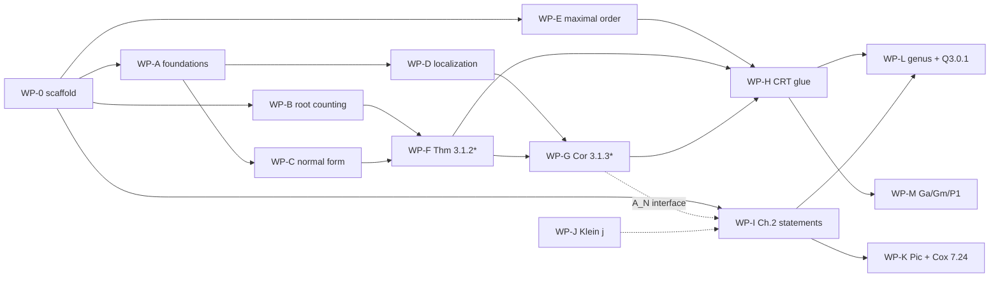

# Work plan — theorem-sized work packages

How the formalization gets built. Each **work package (WP)** is a large, self-contained
chunk — a whole theorem plus every lemma on the way to it — sized so one engineer owns it
end to end. Packages communicate only through **frozen statement interfaces** (see
Working agreements), so they parallelize.

Companions: [PLAN.md](PLAN.md) (architecture, Mathlib audit), [ERRATA.md](ERRATA.md)
(corrected statements — **blueprint ground truth**), [docs/proof-map.html](docs/proof-map.html)
(interactive dependency graph), [THESIS_MAP.md](THESIS_MAP.md) (existing code map).

## Milestones

| | Milestone | Packages | Meaning |
|--|-----------|----------|---------|
| M0 | Scaffold | WP-0 | Blueprint + CI + test harness up; statements frozen |
| M1 | Chapter 3 preliminaries | WP-A, WP-B, WP-C, WP-D, WP-E | Every §3.2 lemma + Prop 3.1.1 sorry-free |
| M2 | **Headline counting theorems** | WP-F, WP-G, WP-H | Thesis Ch. 3 fully formal (corrected statements); the publishable core |
| M3 | Conjecture stated | WP-I (+WP-J stretch) | LV Conj 1.7 stated sorry-free over audited axioms |
| M4 | Research | WP-K, WP-L, WP-M | Question 3.0.1 instrumentation + extensions |

## Package dependency graph

Parallel waves: **wave 1** = WP-0, WP-B, WP-E (independent) · **wave 2** = WP-A, then WP-C ∥ WP-D ∥ WP-I(transcription half) · **wave 3** = WP-F, then WP-G · **wave 4** = WP-H ∥ WP-I(Lean half) · **wave 5** = research.

## Working agreements (every package)

1. **Statements are frozen before proofs start.** WP-0 lands every package's headline
   statements as `sorry`-stubs in `Defs/` + `Counting/Statements.lean`, reviewed against
   ERRATA.md and the blueprint prose. A package's job is to *remove sorries under its
   statements without changing them*; statement changes require a PR touching the
   blueprint + sign-off from the driver (Caleb/Claude).
2. **One PR train per package** into `main` (PR-gated, CI green). Small stacked PRs
   within a package are encouraged; the package is done when its last PR merges.
3. **Definition of done, uniformly**: zero sorries in the package's files ·
   `#print axioms` on every headline = `[propext, Classical.choice, Quot.sound]`
   (plus declared `Assumptions/` axioms only for WP-I) · regression vectors pass
   (`Examples.lean`) · blueprint nodes flipped to `\leanok` · `leanblueprint checkdecls`
   passes · file headers follow the THESIS_MAP convention (Thesis / This file proves /
   Divergence).
4. **Mathlib style**: module docstrings, public-decl docstrings, naming conventions,
   100 cols, `#lint` clean. One result per file; split monster case analyses into case
   files feeding an assembly file.
5. **Don't trust the thesis text** where ERRATA.md overrides it; don't trust the thesis
   PDF's Chapter 2 rendering at all (glyphs lost) — WP-I transcribes from `papers/`.

---

## WP-0 — Scaffold, statement freeze, test harness

**Goal:** everything the other packages need on day one.
**Depends on:** nothing. **Unblocks:** everyone.

Scope:
- Bump Mathlib pin (needs 2025-26 additions: `CommRing.Pic`, `ClassGroup.equivPic`,
  `QuadraticAlgebra`, `NumberField.Ideal.KummerDedekind`); fix breakage in existing
  `singular_moduli/` code; re-verify PLAN §3.1 declarations *with hypotheses* on the pin.
- leanblueprint scaffold (LaTeX prose seeded from PLAN/ERRATA; `\uses{}` edges from the
  proof map; CI deploy via GitHub-Actions-style Forgejo workflow or CI-only builds —
  PLAN decision D5). doc-gen4 wiring.
- **Statement freeze**: land `Defs/Setup.lean` (`ConductorPrimeSetup` class bundling
  d = Df², D fundamental < 0, p prime, p ∣ f, w = v_p f), `Defs/Counting.lean`
  (`idealCount d p m`, `invertibleIdealCount d p m` as `Nat.card` of the right sets),
  and sorry-stubs for every WP headline (corrected Thm 3.1.2*, Cor 3.1.3*, Prop 3.1.1,
  Lemmas 3.2.2–3.2.8 with standing hypotheses made explicit per ERRATA E6).
- **Test harness**: decidable brute-force enumerator of ideals of index n in O_d
  (via Hermite-normal-form sublattices of ℤ² closed under τ-multiplication) +
  `#eval`/`decide` regression suite from the ERRATA tables (d = −16, −27, −36, −48,
  −72, −112, −192; both total and invertible counts). Every counting package tests
  against this.
- Chores: delete `Thermodynamics.lean`; decide D6 (keep nested `singular_moduli/`
  layout vs lift to root — recommend keep, rename later if ever).

Deliverables: green CI, blueprint site, `Defs/`, harness, all stubs compiling.
**Done when:** repo compiles with only the frozen `sorry` stubs; harness reproduces
every ERRATA data point; blueprint renders with the full dependency graph.

---

## WP-A — Order foundations: index layer, primary bridge, units

**Goal:** the general-purpose machinery every counting proof stands on.
**Depends on:** WP-0. **Unblocks:** WP-C, WP-D, WP-F, WP-G, WP-H.

The theorem-chunk: *"an ideal of p-power index in O_d (p ∣ f) is 𝔭-primary for the
unique prime 𝔭 above p, and index is the right norm."* Everything needed to make that
sentence formal:

- Index layer on `Submodule.cardQuot` / `AddSubgroup.index` — **not** `Ideal.absNorm`'s
  multiplicative API (Dedekind-gated; multiplicativity is *false* for non-invertible
  ideals of O_d). Finiteness of {a : [O:a] = n} (Smith normal form:
  `Submodule.smithNormalFormOfLE` exists). Multiplicativity for comaximal ideals (CRT).
- Extract from the existing `Prime/` files the named corollary: **unique prime of O_d
  above every p ∣ f** (Rem 3.2.3's consequence; the §3.2 standing hypothesis).
- Bridge lemma (a): index p^m ⇒ 𝔭-primary (ERRATA E6.4a), via the unique-prime fact.
- p-primary decomposition of a finite-index ideal + count factorization
  #{[O:a] = n} = ∏_p #{[O:a] = p^{v_p(n)}}.
- Units: O_d^× = {±1} for d < −4; w(d) ∈ {2,4,6} (positive-definite norm form).
  (Needed by WP-I; small, lives here because it's order API.)

Existing code: order construction + prime trichotomy already done (`Basic`, `Norm`,
`Discriminant`, `Prime/*`) — build on it, don't rewrite.
**Done when:** `idealCount` decomposes over primes; the bridge lemma is usable by WP-C;
units API simp-able; harness agreement on composite-index counts.

---

## WP-B — Root counting complete (Lemma 3.2.6, all p)

**Goal:** the arithmetic engine: exact count of solutions of x² ≡ p^{2r}u (mod p^s).
**Depends on:** WP-0 only (Mathlib-pure — no order theory). **Unblocks:** WP-F, WP-G.

- Finish the **p = 2 general case**: 2^r, 2^{r+1}, 2^{r+2} solutions as s−2r = 1, 2, ≥ 3
  (base cases mod 2/4/8 already proved: `cardSqrts_two/_four_odd/_eight`).
  ⚠ ERRATA E3: the residue condition is on **s − 2r**, not s — the exact slip that
  broke the thesis's 2-adic cases. State counts directly (no chosen square root of u),
  with the p = 2 QR condition as u ≡ 1 mod min(2^{s−2r}, 8) (ERRATA E6.5).
- Restructure `RootCounting.lean` (838 lines) into `RootCounting/{Defs, OddPrimeCoprime,
  OddPrimeEvenVal, ZeroCase, TwoPower}.lean`; de-densify the ~320-line Hensel-lift proof
  (interior comments, extracted sublemmas). Ingredients: `ZMod.isCyclic_units_of_prime_pow`,
  `Nat.totient_prime_pow`, units-of-ℤ/2^n structure.
- Upstream candidate: prepare `ForMathlib/Data/ZMod/SqrtCard.lean` and open the
  Mathlib PR (first external contribution from the project).

**Done when:** one uniform `cardSqrts` closed form covering every (p, r, s) regime,
`decide`-checked on a grid of small cases; odd-p results refactored w/o statement drift.

---

## WP-C — The normal form keystone (Lemma 3.2.4 + 3.2.5 + bijection)

**Goal:** the whole keystone theorem: 𝔭-primary ideals of index p^m ↔ (k, [A]) pairs.
**Depends on:** WP-A. **Unblocks:** WP-F (and WP-D's 3.2.8).

The chunk = complete Lemma 3.2.4 as a **bijection**, not just a classification:

- Existence: every 𝔭-primary ideal of index p^m equals (p^k, p^{m−k}(τ−A)) with
  ⌈m/2⌉ ≤ k ≤ m, g(A) ≡ 0 mod p^{2k−m} (two-generator reduction in ℤ/p^k[x]/(g);
  thesis proof has sign slips — ERRATA E6.9).
- Uniqueness of (k, [A]): k as the minimal p-power in a; [A] unique mod p^{2k−m}
  (uses `canonicalIdeal_eq_zSpan`, already proved).
- Converse **with minimality** (bridge lemma (b), ERRATA E6.4b): the constructed ideal
  is 𝔭-primary of index p^m *and its minimal p-power is exactly p^k* — otherwise
  ideals double-count across k.
- Package as: `idealCount d p m = Σ_{k=⌈m/2⌉}^{m} #{A ∈ ℤ/p^{2k−m} : g(A) = 0}` —
  the exact summation formula WP-F consumes.

Existing code: `CanonicalForm.lean` scaffolding (`CanonicalAdmissible`, zSpan lemma).
**Done when:** the summation formula is proved and harness-checked for small (d, p, m).

---

## WP-D — Localization suite (Lemmas 3.2.2, 3.2.7, 3.2.8)

**Goal:** the complete local theory at the unique prime over p ∣ f.
**Depends on:** WP-A (unique-prime fact). **Unblocks:** WP-G.

- Lem 3.2.2: O_𝔭 = ℤ₍ₚ₎[τ] when 𝔭 is the unique prime over p; α ∈ O invertible in
  O_𝔭 ⇔ p ∤ N(α). ⚠ False for split p — carry the hypothesis explicitly (ERRATA E6.2);
  Mathlib assist: `Localization.AtPrime`, `Localization.localRingHom_bijective_of_not_conductor_le`.
- Lem 3.2.7: (p^r(τ−a))O_𝔭 ∩ ℤ₍ₚ₎ = p^{r+v_p(N(τ−a))}ℤ₍ₚ₎ (rename the shift variable —
  collision with 3.2.6's s, ERRATA E6.7).
- Lem 3.2.8: p^r(τ−α)O_𝔭 = p^r(τ−β)O_𝔭 ⇔ equal valuations ∧ α ≡ β mod p^v — spell out
  the contraction-normal-form delegation the thesis leaves implicit (needs WP-C's
  uniqueness; coordinate on the interface, or land 3.2.8 last).
- Prove O_𝔭 is *not* a DVR for p ∣ f (`IsDiscreteValuationRing.TFAE`) — guardrail
  lemma documenting why none of the Dedekind API applies.

**Done when:** all three lemmas sorry-free with explicit standing hypotheses; the
non-split hypothesis is a named class/abbrev shared with WP-C.

---

## WP-E — Maximal-order counts (Prop 3.1.1)

**Goal:** the Dedekind-side count, the warm-up theorem.
**Depends on:** WP-0 only. **Unblocks:** WP-H.

- #{a ⊆ O_K : N(a) = p^m} = m+1 / 1 / 0 by splitting type, via unique factorization of
  ideals (`Ideal.uniqueFactorizationMonoid`, `Ideal.absNorm` — legitimate here, O_K *is*
  Dedekind) + the splitting trichotomy (Kummer–Dedekind or the QNF-style Legendre
  criterion; existing `Prime/` files give it for O_d = O_K when f = 1).
- State for any quadratic field (imaginary not needed — ERRATA E6.9), specialize later.
- Bonus (cheap here, needed by WP-H): #{a : N(a) = n} = Σ_{e|n} χ_D(e) for O_K —
  the divisor-sum identity; missing from Mathlib, natural ForMathlib target.

**Done when:** Prop 3.1.1 sorry-free + harness agreement for f = 1 orders; divisor-sum
identity proved or explicitly descoped to WP-H.

---

## WP-F — Theorem 3.1.2* (headline #1: all ideals of norm p^m)

**Goal:** the thesis's main counting theorem, **corrected p-uniform statement**
(ERRATA E4) — one formula, no 2-adic case split.
**Depends on:** WP-B (root counts) + WP-C (summation formula). **Unblocks:** WP-G, WP-H.

- Assemble: idealCount = Σ_k #roots(g mod p^{2k−m}), completing the square
  (x ↦ x + d/2; 2-adic variant), then WP-B's closed forms summed by regime
  (k ≤ κ vs k > κ, κ = (v_p(d/4)+m)/2). Geometric-series and floor/ceiling bookkeeping.
- Case files: `Total{Trivial,Ramified,Inert,Split}.lean` → `Total.lean` assembly.
- ⚠ v_p(d/4) notation trap (ERRATA E6.8): v_p(d) for odd p, v₂(d)−2 for p = 2 — the
  frozen statement uses an explicit `v` definition, keep it.
- Regression: full ERRATA E1/E2 table (d = −16 m = 3,5; d = −48 m = 3,4; d = −192
  m = 5) + trivial-branch and odd-p spot checks — these vectors are the whole reason
  the corrected statement is trustworthy.

**Done when:** Thm 3.1.2* sorry-free, `#print axioms` clean, all vectors green,
blueprint chapter 3 node dark-green.

---

## WP-G — Invertibility + Corollary 3.1.3* (headline #2)

**Goal:** the invertible-ideal count, corrected regime (ERRATA E5), plus the
invertibility interface the rest of the project consumes.
**Depends on:** WP-D, WP-F. **Unblocks:** WP-H, WP-I (A(N)), WP-L.

- Invertibility interface (exported, used by WP-I's A(N)): invertible ⇔ locally
  principal for f.g. ideals of a Noetherian domain; locality; prime-to-conductor ⇒
  invertible; at q ≠ p an index-p^m ideal is locally trivial. Audit Mathlib
  `FractionalIdeal` outside Dedekind and fill gaps (expect real work here).
- Classify which normal-form ideals are locally principal via WP-D's 3.2.7/3.2.8:
  count α with v_p(N(τ−α)) exactly 2k−m (root-but-not-a-lift analysis, WP-B's counts).
- Assemble Cor 3.1.3* under the **corrected regime**: trivial branch iff m < v or
  (m = v = 2w−2); case branch iff m > v or (m = v ≥ 2w). Statement says *invertible*;
  includes inert-odd 0 case and the m = 0 corner (ERRATA E5, E6.1).
- Regression: d = −48 m = 2 → 2; d = −112 m = 2 → 2 (thesis regime gave −2!);
  d = −192 m = 4 → 4; p = 3 boundary rows (d = −27, −36, −72).

**Done when:** Cor 3.1.3* sorry-free; invertibility interface documented as the
stable API; vectors green.

---

## WP-H — CRT glue: counts for arbitrary norm n

**Goal:** beyond-thesis completion — the full multiplicative count in O_d.
**Depends on:** WP-A, WP-E, WP-F, WP-G. **Unblocks:** WP-L, WP-M.

- Norm-preserving bijection between ideals of index coprime to f in O_d and in O_K
  (conductor-avoiding localization iso → ideal correspondence, stated and proved).
- Glue: #{a : [O:a] = n} = ∏_{p ∣ f} (WP-F count) × ∏_{p ∤ f} (WP-E count); same for
  invertible ideals; divisor-sum form where applicable.
- Package the results as a clean `IdealCount` API: `idealCount d n`,
  `invertibleIdealCount d n`, decidable instances synced with the harness.

**Done when:** `#eval` brute force = closed form on a randomized grid of (d, n);
this is the counting instrument WP-L uses for research.

---

## WP-I — Chapter 2 statement layer (state everything; prove 2.2.2)

**Goal:** LV Conjecture 1.7 stated sorry-free in Lean over an audited axiom layer.
**Depends on:** WP-0 (transcription can start immediately); WP-G's invertibility
interface for A(N) (code against the frozen stub meanwhile). **Unblocks:** WP-K, WP-L.

Two halves, one owner:

*(i) Transcription + definitions (no Lean blockers):*
- Transcribe from `papers/` (thesis PDF is glyph-damaged, ERRATA E7): GZ85 Thm 1.3 +
  Cor 1.6 exact exponents/inequalities; Dor88 Thm 1.2 + genus characters; LV15b
  Thm 1.1, **Thm 1.5 (ρ, A(N), r-sum index)**, **Conj 1.7 (both case functions)**;
  reconcile the 8/(w₁w₂) vs 4/(w₁w₂) normalizations. Output: blueprint prose quoting
  the originals — this unblocks every statement below and settles ERRATA E7.
- Characters: vendor `kroneckerSym` from WangFrankie/QuadraticNumberFields
  (Apache-2.0, `Vendor/`, attributed); define Dorman's genus characters ε_p; encode
  Hilbert-symbol conditions via Legendre symbols + valuations (PLAN decision D4).

*(ii) Lean statements + the one proof:*
- `Assumptions/` axiom files, FLT-style (one axiom per file, docstring + citation +
  honesty caveats): integrality/conjugates of singular moduli, ring class field,
  J-integrality. j : ℍ → ℂ as an interface (PLAN D3; honest j = WP-J).
- Definitions: J(d₁,d₂) over SL₂(ℤ)-classes; F(m); ρ; **A(N)** against WP-G's
  invertibility API ('p ∤ b' needs a formal divisibility notion at non-invertible
  primes — design decision, document it).
- Statements: GZ Thm 2.2.1, Dorman 2.3.1, LV 2.4.1/2.4.2, **Conj 2.4.3**.
- **Prove Cor 2.2.2** conditionally on the GZ statement (elementary QR arguments) —
  the package's real proof, `#print axioms` showing exactly the declared axioms.
- `Examples.lean` audit section for the whole layer.

**Done when:** Conj 2.4.3 compiles sorry-free; axioms quarantined + audited;
Cor 2.2.2 proved; blueprint Ch. 2 fully written with paper-verbatim prose.

---

## WP-J — Klein j honest definition (stretch, Mathlib track)

**Goal:** replace the j-interface axiom with j := E₄³/Δ.
**Depends on:** nothing in-repo (pure Mathlib). **Unblocks:** strengthens WP-I.

SL₂(ℤ)-invariance, holomorphy, q-expansion 1/q + 744 + … (integrality of coefficients
is the hard part). All ingredients verified present (E₄/E₆ `eisensteinSeriesMF`,
`ModularForm.discriminant` nonvanishing, `UpperHalfPlane.qExpansion` API). Run as
Mathlib PRs; swap into WP-I's interface on landing. Independent; assign to whoever
wants the modular-forms work.

## WP-K — Pic(O_d) finiteness + conductor exact sequence (research)

Cox Thm 7.24: exact sequence relating Pic(O_d) and Cl(K); finiteness of Pic(O_d);
h(O) = h(K)·f·∏(1−(D/p)/p)/[O_K^×:O^×]. Mathlib assists: `ClassGroup` (any domain),
`ClassGroup.equivPic`, `ClassGroup.extendedHom`, `NumberField.classNumber`. Absent
everywhere; QNF has WIP at conductor 2 — check their branches first. Needed for
Conj 2.4.3's H term. **Depends on:** WP-A, WP-G interface.

## WP-L — Genus classes + Question 3.0.1 loop (research)

The thesis's proposed direction. Define genus/class assignment for invertible ideals
meeting the conductor; formulate candidate corrected A′(N); run the falsification
loop — `decide`-able counts (WP-H) vs Sage/PARI oracle factorizations of J(d₁,d₂)
(sageify-style certificates). A surviving candidate becomes the target of a
Thm 2.4.2-without-coprimality campaign. **Depends on:** WP-H, WP-I.

## WP-M — Ga/Gm/P¹(ℤ/p^r) observation (research, self-contained)

Formalize §3.4's observation as a theorem about the closed forms: order/maximal count
ratios = |Ga|, |Gm|, |P¹|(ℤ/p^r). P¹ over ℤ/p^r has no Mathlib home (Projectivization
needs a division ring) — define the count p^{r−1}(p+1) directly. Small, original,
publishable alongside M2. **Depends on:** WP-H (formulas only).

---

## Assignment sheet

| WP | Milestone | Size | Can start | Blocked by |
|----|-----------|------|-----------|------------|
| WP-0 | M0 | M | now | — |
| WP-B | M1 | M | now | WP-0 (statements only) |
| WP-E | M1 | S | now | WP-0 (statements only) |
| WP-A | M1 | L | after WP-0 | WP-0 |
| WP-C | M1 | L | after WP-A | WP-A |
| WP-D | M1 | M | after WP-A | WP-A |
| WP-F | M2 | L | after WP-B+WP-C | WP-B, WP-C |
| WP-G | M2 | L | after WP-D+WP-F | WP-D, WP-F |
| WP-H | M2 | M | after WP-G | WP-A, WP-E, WP-F, WP-G |
| WP-I | M3 | L | transcription now; Lean after WP-G iface | WP-0, (WP-G) |
| WP-J | stretch | L | anytime | — |
| WP-K | M4 | L | after WP-A | WP-A, WP-G |
| WP-L | M4 | XL | after WP-H+WP-I | WP-H, WP-I |
| WP-M | M4 | S | after WP-H | WP-H |

S ≈ days, M ≈ 1–2 weeks, L ≈ 2–4 weeks, XL = open-ended research.

Minimum-staffing path to M2: WP-0 → WP-A → (WP-B ∥ WP-C ∥ WP-D) → WP-F → WP-G → WP-H,
with WP-E and WP-I(i) slotted anywhere.
